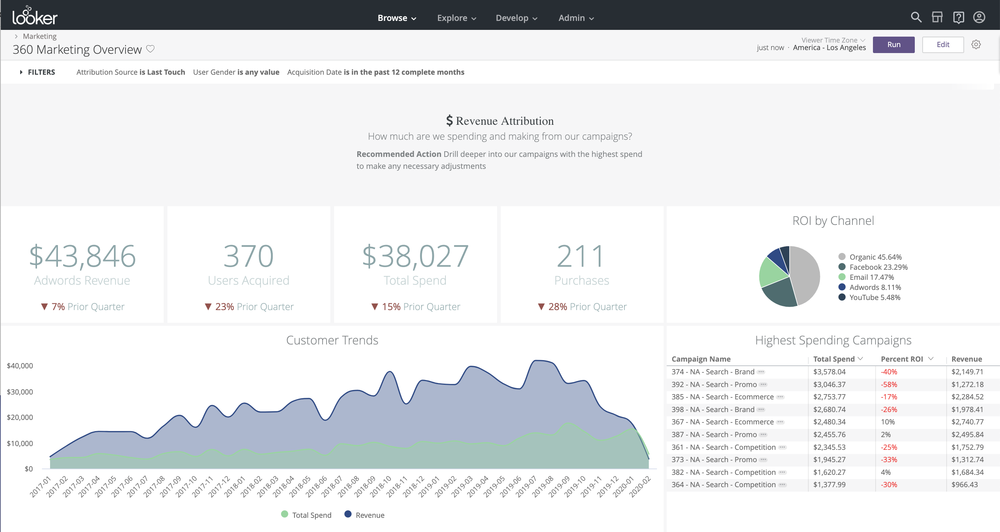
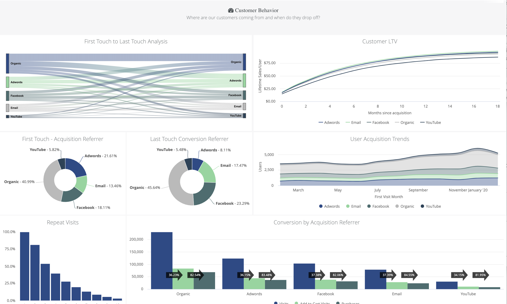
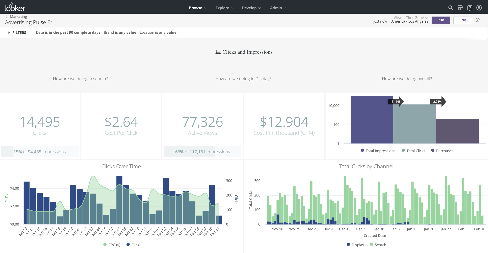
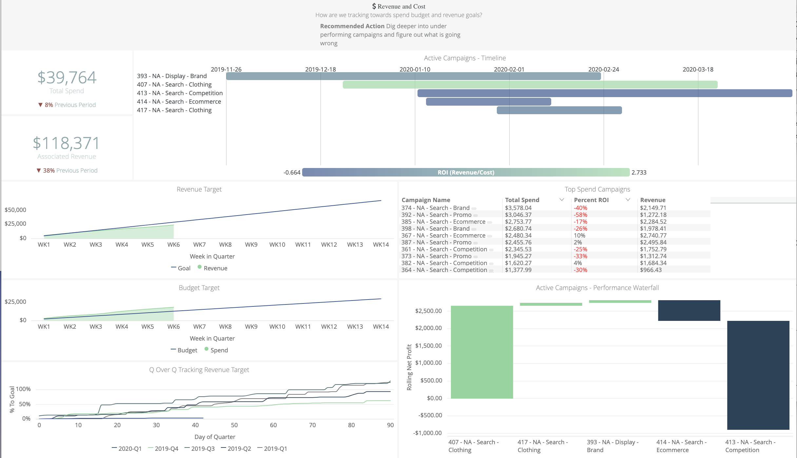
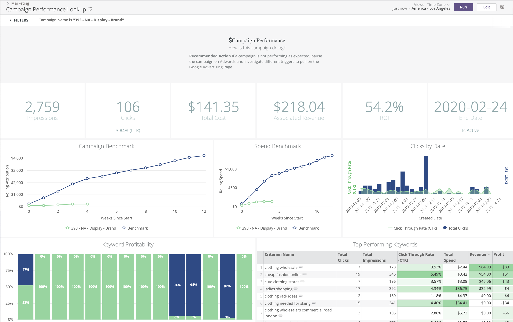

# Marketing Demo

## Description

This demo uses dummy data from Google Adwords, as well as Ecommerce clothing store order data, to show things like digital marketing attribution and campaign ROI.

The LookML model is divided into a few folders:

 
**Dashboards:**

306 Marketing Overview:

Advertising Pulse:

Campaign Performance Lookup:

